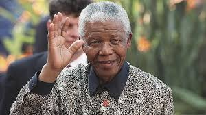

# Biography Nelson Mandela

Nelson Mandela (1918 – 2013) was a South African political activist who spent over 20 years in prison for his opposition to the apartheid regime; he was released in 1990. In 1994, Mandela was later elected the first leader of a democratic South Africa. He was awarded the Nobel Peace Prize (jointly with F.W. de Klerk) in 1993 for his work in helping to end racial segregation in South Africa. He is considered the father of a democratic South Africa and widely admired for his ability to bring together a nation, previously divided by apartheid. Nelson Mandela is one of the most admired political leaders of the Twentieth and Twenty-First Century for his vision to forgive and forge a new ‘rainbow’ nation.
Nelson Mandela was born in Transkei, South Africa on July 18, 1918. He was the son of a local tribal leader of the Tembu tribe. As a youngster, Nelson took part in the activities and initiation ceremonies of his local tribe. However, unlike his father Nelson Mandela gained a full education, studying at the University College of Fort Hare and also the University of Witwatersrand. Nelson was a good student and qualified with a law degree in 1942.

During his time at University, Nelson Mandela became increasingly aware of the racial inequality and injustice faced by non-white people. In 1943, he decided to join the ANC and actively take part in the struggle against apartheid.

As one of the few qualified lawyers, Nelson Mandela was in great demand; also his commitment to the cause saw him promoted through the ranks of the ANC. In 1956, Nelson Mandela, along with several other members of the ANC were arrested and charged with treason. After a lengthy and protracted court case, the defendants were finally acquitted in 1961. However, with the ANC now banned, Nelson Mandela suggested an active armed resistance to the apartheid regime. This led to the formation of Umkhonto we Sizwe, which would act as a guerilla resistance movement. Receiving training in other African countries, the Umkhonto we Sizwe took part in active sabotage.

In 1963, Mandela was again arrested and put on trial for treason. This time the State succeeded in convicting Mandela of plotting to overthrow the government. However, the case received considerable international attention and the apartheid regime of South Africa became under the glare of the international community. At the end of his trial, Nelson Mandela made a long speech, in which he was able to affirm his commitment to the ideals of democracy.
Mandela’s death sentence was commuted to life imprisonment and from 1964 –1981 he was incarcerated at Robben Island Prison, off Cape Town. In prison the conditions were sparse; however, Mandela was with many other political prisoners, and there was a strong bond of friendship which helped to make more bearable the difficult prison conditions. Also, in prison, Nelson Mandela was highly disciplined; he would try and study and take part in exercise every day. He later said these year of incarceration in jail were a period of great learning, even if painful. Mandela also created friendships with some of the guards. Mandela would later say that he felt he was fighting the apartheid system and not individual white people. It was in prison that Mandela became aware of the passion that Afrikaners had for rugby, and he developed an interest himself.

